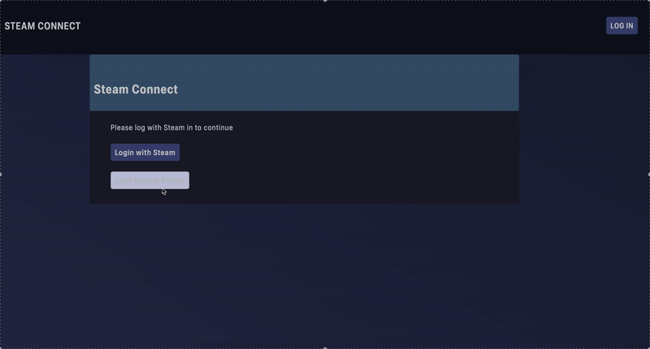

# Steam Connect | FullStack Web App

This project demonstrates a **fullstack web app** that connects to Steam, the massively popular video game platform. It uses Steam authentication to fetch and display data from the Steam API. Upon authentication, a session is created and a cookie is sent to your browser. 


## Tech Stack
Frontend: React (Vite), HTML/CSS

Backend Server: Node.js, Express

Authentication: Passport.js library using steam-strategy

Sessions: express-session + cookies

Deployment: Render (Backend & Frontend)


## Check it out
[Hosted Demo](https://steamconnect.onrender.com/)

Authentication is blocked due to the onrender domain being on the public suffix list. 
Instead, you can fetch a sample profile from the backend server.


## Technical Features
- **React Frontend**: Dynamically changing HTML using React framework.
- **Functional Backend**: Express backend, effectively communicates data with frontend.
- **Server Middlware**: Express middleware handles HTTPS, CORS and environment variables.
- **Sessions and Cookies**: Sessions and cookies initialised for seamless authentication.
- **Oauth Login**: Passport.js Steam Strategy authenticates and provides user data to server.

## Project Features
- **User Dashboard**: User's account data is displayed on login.
- **Steam Inventory**: User's Steam inventory is loaded, parsed and displayed.
- **Sample Profile**: User can view a sample profile from the server, avoiding Steam login.


## How to Run Locally
Download the repository, install dependencies:

Configure an environment file(.env) with these variables.

STEAM_API_KEY=01234 

SECRET_KEY=anycode

FRONTEND_URL=http://localhost:XXXX

VITE_SERVER_URL=http://localhost:XXXX

PORT=XXXX


Frontend:
```npm run dev```

Backend Server:
```node src/server.js```


## Demo


